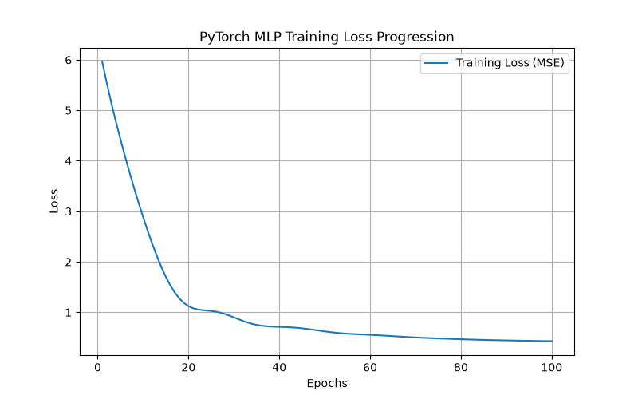

# Assignment 2: Single-Layer/Shallow Network for Regression

## How to Run

This project requires the `env_csci4425` Conda environment 
  # requirements:
  - Python 3.12.2
  - Conda / Miniconda
  - torch
  - scikit-learn
  - pandas
  - numpy

```bash
conda activate env_csci4425
python hw2.py
```

Running the script will:
- Print dataset exploration output to the console
- Train both models (Linear Regression and PyTorch MLP)
- Print training loss every 10 epochs
- Save the training loss plot as `loss_curve.png`
- Print final evaluation metrics for both models

---

## Part 1: Data Loading and Exploration

The California Housing dataset has 20,640 instances and 8 numeric predictive
attributes, with the target being the median house value for California
districts (in units of $100,000). Features include median income, house age,
average rooms, average bedrooms, population, average occupancy, latitude,
and longitude.

### First 5 Rows

| MedInc | HouseAge | AveRooms | AveBedrms | Population | AveOccup | Latitude | Longitude | MedHouseVal |
|--------|----------|----------|-----------|-------------|----------|----------|-----------|-------------|
| 8.3252 | 41.0 | 6.984127 | 1.023810 | 322.0 | 2.555556 | 37.88 | -122.23 | 4.526 |
| 8.3014 | 21.0 | 6.238137 | 0.971880 | 2401.0 | 2.109842 | 37.86 | -122.22 | 3.585 |
| 7.2574 | 52.0 | 8.288136 | 1.073446 | 496.0 | 2.802260 | 37.85 | -122.24 | 3.521 |
| 5.6431 | 52.0 | 5.817352 | 1.073059 | 558.0 | 2.547945 | 37.85 | -122.25 | 3.413 |
| 3.8462 | 52.0 | 6.281853 | 1.081081 | 565.0 | 2.181467 | 37.85 | -122.25 | 3.422 |

### Summary Statistics

| Stat | MedInc | HouseAge | AveRooms | AveBedrms | Population | AveOccup | Latitude | Longitude | MedHouseVal |
|------|--------|----------|----------|-----------|-------------|----------|----------|-----------|-------------|
| count | 20640 | 20640 | 20640 | 20640 | 20640 | 20640 | 20640 | 20640 | 20640 |
| mean | 3.8707 | 28.6395 | 5.4290 | 1.0967 | 1425.4767 | 3.0707 | 35.6319 | -119.5697 | 2.0686 |
| std | 1.8998 | 12.5856 | 2.4742 | 0.4739 | 1132.4621 | 10.3861 | 2.1360 | 2.0035 | 1.1540 |
| min | 0.4999 | 1.0 | 0.8462 | 0.3333 | 3.0 | 0.6923 | 32.54 | -124.35 | 0.1500 |
| 25% | 2.5634 | 18.0 | 4.4407 | 1.0061 | 787.0 | 2.4297 | 33.93 | -121.80 | 1.1960 |
| 50% | 3.5348 | 29.0 | 5.2291 | 1.0488 | 1166.0 | 2.8181 | 34.26 | -118.49 | 1.7970 |
| 75% | 4.7433 | 37.0 | 6.0524 | 1.0995 | 1725.0 | 3.2823 | 37.71 | -118.01 | 2.6473 |
| max | 15.0001 | 52.0 | 141.9091 | 34.0667 | 35682.0 | 1243.3333 | 41.95 | -114.31 | 5.0000 |

---

## Part 2: Data Preprocessing

- The dataset was split into 80% training and 20% testing sets using
  `train_test_split` with `random_state=0` for reproducibility.
- Features were scaled using `StandardScaler`, fit only on the training set
  and then applied to both the training and testing sets to avoid data
  leakage.

---

## Part 3: Model Building and Training

Two models were built:

1. **Baseline Linear Regression** (Scikit-learn) — trained directly on the
   scaled training data.
2. **Neural Network (MLP)** (PyTorch) — a shallow network with:
   - Input layer (8 features) → Hidden layer (32 neurons) → ReLU → Output layer (1 neuron)
   - Loss function: Mean Squared Error (`nn.MSELoss`)
   - Optimizer: Adam, learning rate = 0.01
   - Trained for 100 epochs

### Training Loss (printed every 10 epochs)

| Epoch | Loss |
|-------|------|
| 10 | 2.8868 |
| 20 | 1.1202 |
| 30 | 0.8989 |
| 40 | 0.7105 |
| 50 | 0.6214 |
| 60 | 0.5531 |
| 70 | 0.5015 |
| 80 | 0.4661 |
| 90 | 0.4427 |
| 100 | 0.4281 |

---

## Part 4: Model Evaluation

Both models were evaluated on the scaled test set using MSE, RMSE, and R².

| Model | MSE | RMSE | R² |
|-------|-----|------|-----|
| Linear Regression | 0.5290 | 0.7273 | 0.5943 |
| PyTorch MLP | 0.4269 | 0.6534 | 0.6726 |

---

## Part 5: Analysis and Interpretation

### Performance Comparison

The PyTorch MLP outperformed the baseline Linear Regression model on every
metric. Its MSE and RMSE are both lower, meaning its predictions are on
average closer to the true median house values, and its R² of 0.6726 (versus
0.5943 for Linear Regression) means it explains a noticeably larger share of
the variance in housing prices. This makes sense: the relationship between
the features (income, location, room counts, etc.) and house price is
unlikely to be purely linear, so a model with a hidden layer and a
non-linear ReLU activation has more flexibility to capture those patterns
than a plain linear equation.

### Training Loss Curve



The loss drops sharply over the first ~20–30 epochs, from around 2.89 down
to about 0.90, as the network quickly learns the main patterns in the data.
After that, the loss continues to decrease but at a much slower and steadily
diminishing rate, ending around 0.428 by epoch 100. This shape is typical of
a well-behaved training run: fast initial learning followed by fine-tuning,
with no sign of instability, spikes, or divergence. The curve is still
gently decreasing at epoch 100, suggesting the model might improve slightly
further with more epochs, but the returns are clearly diminishing.